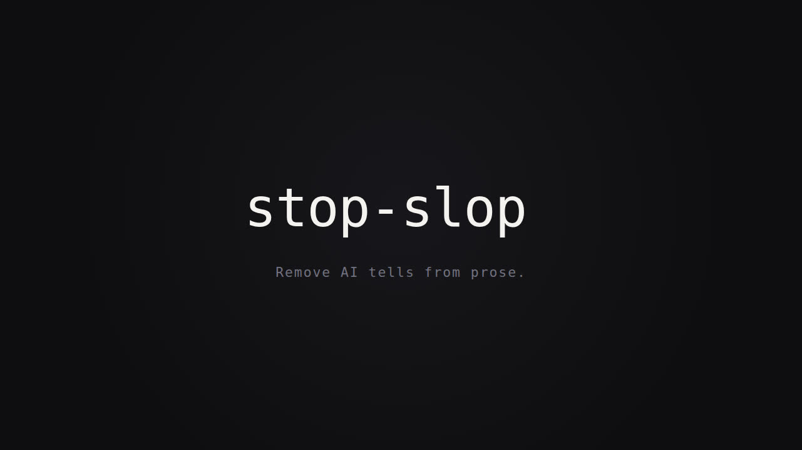
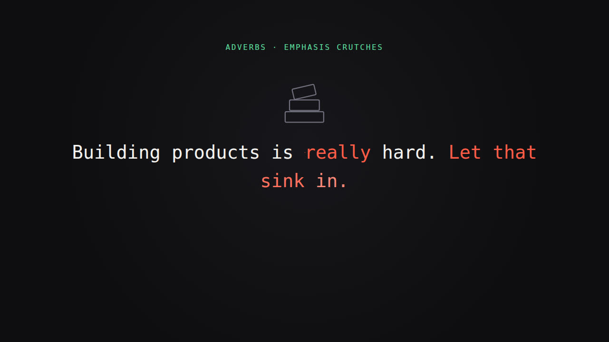
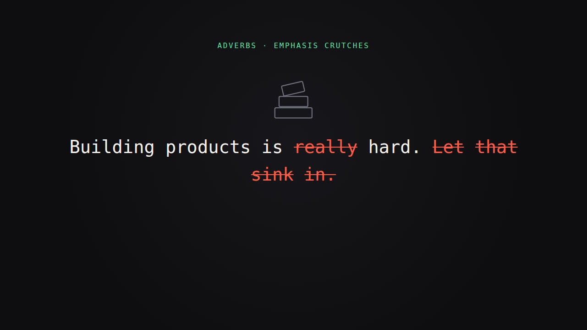
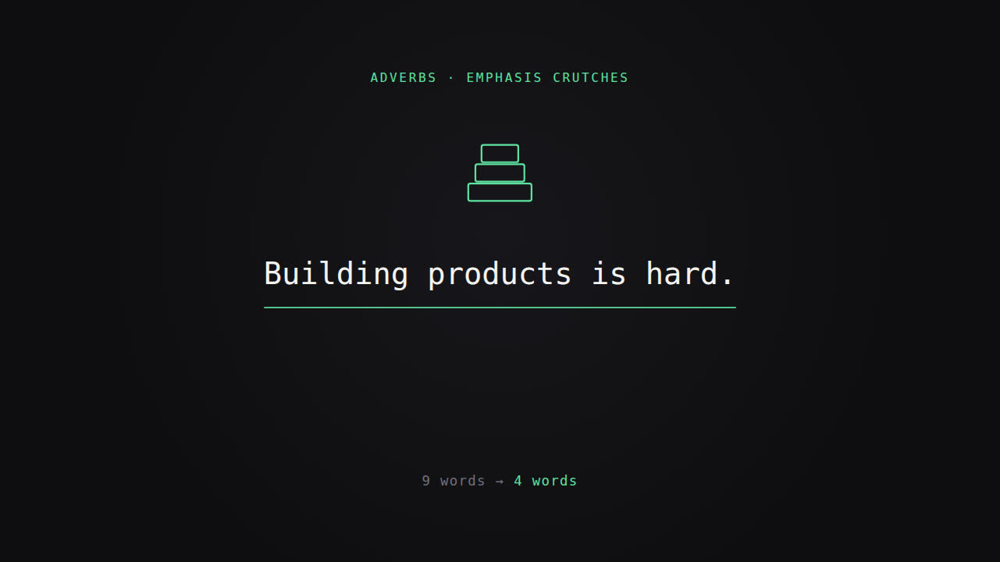
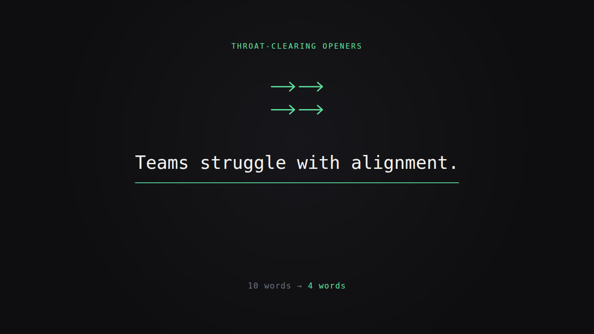

# stop-slop video

A [Remotion](https://www.remotion.dev) project that animates what the skill does to prose.

## The animation

24.8s, 1920×1080, 30fps. An intro, three worked examples, an outro.

Each example takes a sentence carrying the tells listed in [`references/phrases.md`](../references/phrases.md), reddens the slop, strikes it through, then drops it while the surviving words slide together into the clean line.

| Example | Rule | Drawing | Before → after |
|---|---|---|---|
| 1 | Adverbs · Emphasis crutches | Stacked blocks | 9 → 4 words |
| 2 | Throat-clearing openers | Four arrows | 10 → 4 words |
| 3 | Vague declaratives · Meta-commentary | Paper plane | 14 → 4 words |

Every example removes words and nothing else, so what the animation deletes is exactly what the skill deletes. The one exception is capitalisation: when a cut phrase sits at the start, the new first word carries an `afterText` so `teams` becomes `Teams`.

Each sentence carries a line drawing of what it talks about, and the drawing is out of sorts while the sentence is: the top block sits askew, the arrows point four ways, the plane hangs still. They settle on the same beat the slop drops out, turning from grey to green as the line comes clean.

## What it looks like



The slop is marked as the sentence is read:



Then struck through:



Then dropped, leaving the clean line and a word count. The blocks straighten as it lands:



The second example does the same with arrows that start pointing four ways:



## Commands

```bash
npm i
npm run dev                    # Remotion Studio
npx remotion render StopSlop   # writes out/StopSlop.mp4
npm run lint                   # eslint + tsc
```

Remotion downloads its own Chrome Headless Shell on first render. Where that host is unreachable, point it at a browser you already have:

```bash
npx remotion render StopSlop --browser-executable=/path/to/headless_shell
```

## Layout

Word positions come from the monospace advance width (`CHAR_RATIO` in `src/StopSlop/theme.ts`) rather than from the DOM. `layout.ts` wraps and centres a list of words into character-grid coordinates; `Sentence.tsx` runs that twice, once over all tokens and once over the survivors, then interpolates each word between its two positions.

Remotion renders frames independently, so a DOM measurement would race the first paint. Computing the grid keeps every frame deterministic.

The font stack starts at DejaVu Sans Mono and Liberation Mono, both ~0.602em advance, so the composition renders the same on machines without a downloaded webfont. Nothing is fetched at render time.

## Files

```
src/StopSlop/
├── examples.ts    the three token lists
├── layout.ts      character-grid wrapping and centring
├── Sentence.tsx   per-word enter, redden, strike, collapse
├── Glyph.tsx      the line drawings and how they settle
├── Scene.tsx      one example's timeline, label, counter
├── Intro.tsx      title card
├── Outro.tsx      end card
├── theme.ts       palette and font stack
└── index.tsx      sequences the scenes
```

## Adding an example

Append to `examples` in `src/StopSlop/examples.ts`. Mark each word to remove with `cut()`; if removing a leading phrase changes the capitalisation of the new first word, give that token an `afterText`. Pick a `glyph` from the kinds in `Glyph.tsx`, or add one there — a glyph takes `draw` and `resolve` from 0 to 1 and draws itself with `pathLength`-normalised strokes. The scene length and total duration follow from the list.

## License

The Remotion parts carry Remotion's own terms — some companies need a licence, see [their terms](https://github.com/remotion-dev/remotion/blob/main/LICENSE.md). Everything else in this repository is MIT.
